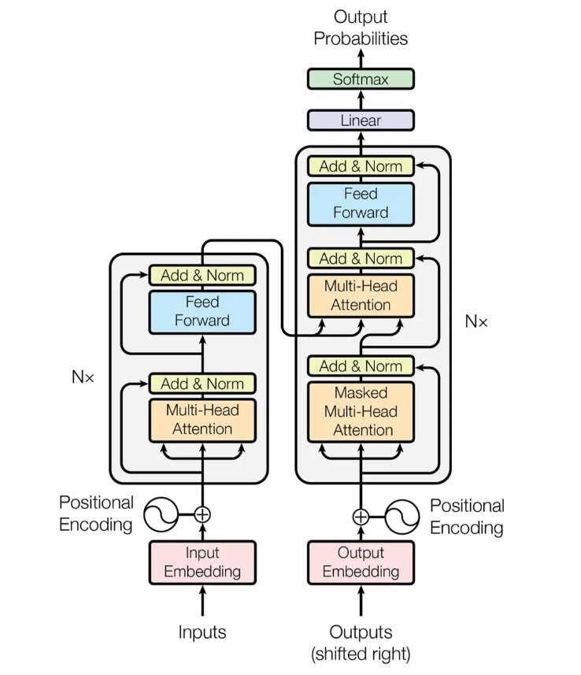
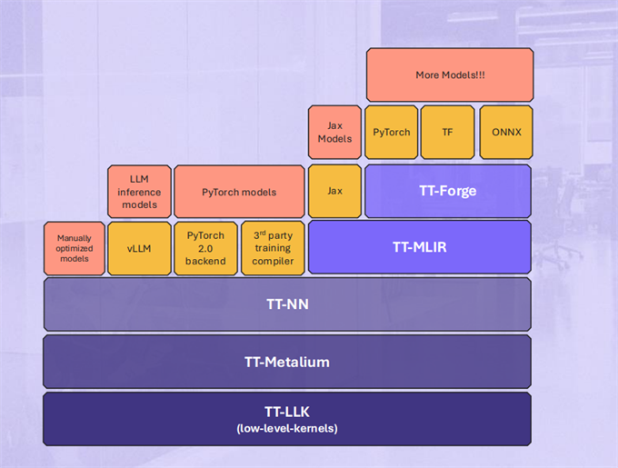
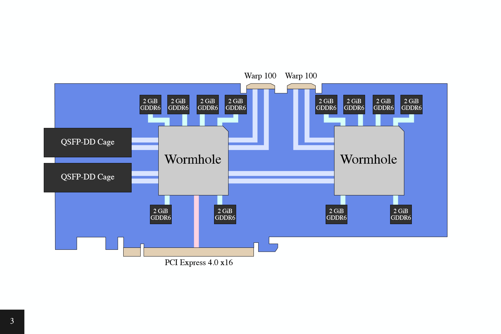
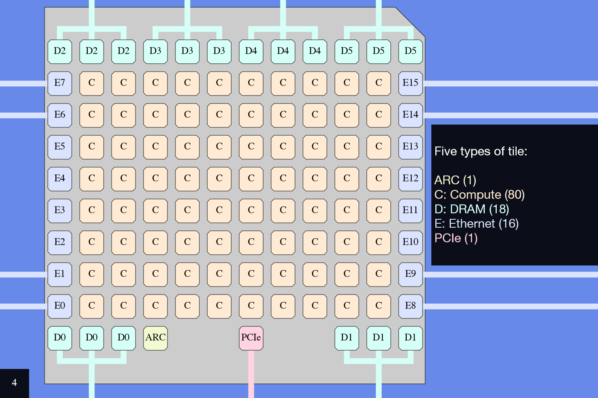
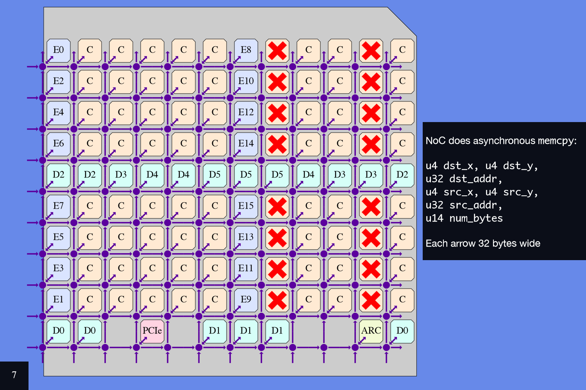
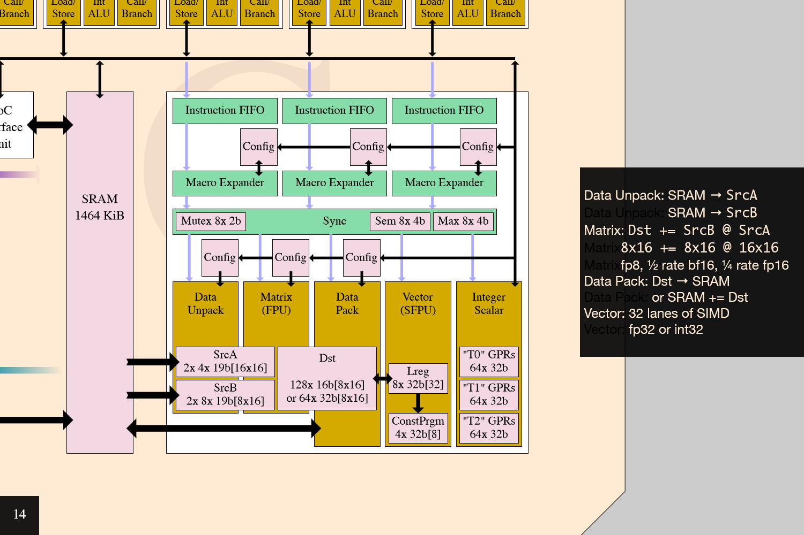

# 从模型到芯片执行：以 Tenstorrent 适配 llama.cpp/ggml 为例

> Tenstorrent 接入 llama.cpp/ggml 推理栈时，一个 LLM 会从模型文件加载到运行时 ggml_cgraph，再由 scheduler 切分并交给硬件 backend 执行。重点放在三个边界：模型文件如何提供 tensor metadata 和量化格式；ggml scheduler 如何按 backend 能力、buffer 归属和 copy 需求切图；Tenstorrent backend 如何处理 layout、buffer、数据搬运和算子调用，并通过 TT-NN 或 Metalium 落到芯片执行。

## 目录

- 推理路径与软件栈入口
  - 模型到算子的执行路径
  - Tenstorrent 软件栈
- llama.cpp、ggml 与 backend 边界
- 权重与量化：进入运行时前的信息
- 从 cgraph 到 backend 执行
  - 从 GGUF 到 ggml_cgraph
  - scheduler 如何切分 cgraph
  - Tenstorrent backend 如何执行 split
- Tenstorrent/Wormhole 硬件约束
- 术语表
- 参考文献

## 推理路径与软件栈入口

### 模型到算子的执行路径

一次 LLM 推理可以先拆成两类对象：模型文件里保存的权重参数，以及运行时根据模型结构和请求组织出来的推理计算图。

以 decoder-only Transformer 为例，推理计算图由多个 Transformer Block 串联构成。每个 block 内部包含 Attention、MLP/FFN、Norm 和残差连接。Self-Attention 处理序列内依赖，KV cache 围绕其中的 Key/Value tensor 读写展开；MLP/FFN 是通道混合与非线性变换路径，主要由 projection 和激活函数组成。进入 llama.cpp/ggml 后，这些模块会展开成 ggml op，并由 backend kernel 执行 [1]。

<p align="center">
  
</p>
*图：Transformer Block 结构示意。Attention、FFN/MLP、Norm 和残差连接共同构成每层 block；在 llama.cpp/ggml 中，这些模块会进一步展开为 ggml_cgraph 中的具体 ggml op，并由后端 kernel 执行。*

执行层面，Transformer Block 不会直接作为一个整体交给芯片。推理系统会把它们分解为 GEMM/GEMV、RMSNorm、Softmax、SiLU、element-wise 等基础算子，或者交给 backend 做进一步融合。小型模型可以把全部 weights 放在一张卡上，graph 顺序跑完即可。大模型面临的问题是参数量和计算量同时超出单卡能力：weights 需要按 layer 切到多卡或留一部分在 CPU，KV cache 跨 device 持久化，runtime 计算图中同一个 op 在不同 dtype、shape、layout 条件下不同 backend 的计算效率不同。先假设芯片软件栈已经具备基本算子库和 runtime：算子库提供高性能 kernel，runtime 负责设备内存、数据拷贝、kernel 启动、同步和执行队列管理。大模型推理要做的是把权重、KV cache 和运行时计算图组织成一串可执行的设备调用，并让内存管理、缓存管理和调度策略配合起来。

### Tenstorrent 软件栈

以大模型接入 Tenstorrent 为例，其软件栈同时提供多个入口。PyTorch、ONNX、JAX、vLLM、llama.cpp/ggml 都可能成为接入路径；它们经过的编译、调度或手工适配等不同流程，最终仍要落到 TT-NN、TT-Metalium 和 TT-LLK 提供的算子库、runtime 与低层 kernel 能力上 [2, 3]。

<p align="center">
  
</p>
根据图中的层级关系，Tenstorrent 软件栈可以概括为四类入口：

```
1. Compiler-first / model-graph lowering（AI 编译器）

   PyTorch / ONNX
   → TT-Forge frontends
   → TT-MLIR
   → TT-NN / TT-Metalium
   → TT-LLK

   JAX
   → TT-XLA / TT-MLIR
   → TT-NN / TT-Metalium
   → TT-LLK

   通用编程框架：通过 TT-Torch、TT-Forge-ONNX、TT-XLA 等前端进入 TT-MLIR，再 lowering 到 Tenstorrent 执行栈。
```

```
2. PyTorch-native compiler backend

   PyTorch models
   → PyTorch 2.0 backend
   → TT-MLIR 或 TT-NN
   → TT-Metalium / TT-LLK

   编译接入：通过 PyTorch 2.0 backend 进入 Tenstorrent 后端，不一定经过 TT-Forge 这类通用模型前端。
```

```
3. Inference-framework backend

   LLM inference models
   → vLLM / tt-inference-server
   → Tenstorrent runtime stack
   → TT-NN / TT-Metalium / TT-LLK

   llama.cpp / ggml
   → ggml backend scheduler
   → Tenstorrent ggml backend
   → TT-NN 或 TT-Metalium
   → TT-LLK

   从已有推理框架的 backend 层接入。vLLM 偏服务器高并发推理，llama.cpp/ggml 偏本地推理和量化部署。
```

```
4. Hand-optimized execution route

   Manually optimized models
   → TT-NN
   → TT-Metalium
   → TT-LLK

   手工组织模型执行和算子调用。
```

入口差别主要体现在抽象层级。越靠近 TT-NN、TT-Metalium、TT-LLK，工程控制力越强，模型覆盖面越窄；越靠近 PyTorch、ONNX、JAX 等上游生态入口，生态兼容性越好，也越依赖编译器完成图捕获、lowering、layout 合法化和 kernel selection。资源有限时，先从推理框架 backend 或手工路径打通真实模型，再补齐通用编译入口，工程风险更可控。

四类入口还可以收束为两组：前两类以编译器为主入口，负责把上游模型图转换、优化并 lowering 到 Tenstorrent 执行栈；后两类从已有推理框架或手工优化执行路径接入。vLLM 这类 serving runtime 负责请求调度、KV cache 和 PagedAttention 等推理运行时问题；llama.cpp/ggml 负责本地模型加载、量化权重和多 backend 执行路径；manual route 进一步减少框架抽象，由工程师直接组织算子调用和低层 kernel，适合少数固定模型或关键路径的定向优化 [3, 4]。

不同路径的"接入"在工程上对应不同的接口实现。编译器路线通过 PyTorch 2.0 的 torch.compile 自定义 backend 机制（torch.compile(..., backend=...) 或 torch.compiler.register_backend）注册一个后端，负责将 FX（PyTorch 的图捕获与 IR 变换工具链）GraphModule 映射到 TT-MLIR 的 lowering 规则或 TT-NN 的算子调用，再对接设备内存分配器和 runtime。框架 backend 路线需要按框架约定的接口逐层实现——以 ggml 为例，ggml_backend_reg 负责注册和设备枚举，ggml_backend_dev 负责 buffer type、supports_op 和 backend 初始化，ggml_backend 负责 graph_compute、tensor 异步读写和同步，ggml_backend_buffer_type 负责 buffer 的分配/释放/对齐（ggml-backend-impl.h）。手工路线跳过了这些分层抽象，直接调用 TT-NN 的设备管理 API（open_device、close_device）和算子 API 构建计算序列，自行管理设备内存和同步。三条路径的核心工作都是把模型的计算表达映射到设备可执行的指令序列，区别在谁来做图切分和内存管理——编译器、框架 scheduler、还是工程师。

选择 llama.cpp/ggml → Tenstorrent backend 作为分析对象，是因为它处在两端之间：前端侧暂时绕开 PyTorch/ONNX/JAX 捕获、IR lowering 和通用图优化；执行侧又保留真实 LLM 推理框架里的模型加载、KV cache、调度和多 backend 执行路径。llama.cpp/ggml 已经提供 LLM 推理流程、ggml_cgraph 构建、backend scheduler 和多 backend 执行框架；Tenstorrent 适配需要处理 tensor 数据放置、backend 切分、跨 backend copy、ggml op 支持判断和实际执行调用 [5, 6]。

下面沿着这条路径展开：先明确 llama.cpp、ggml 和 Tenstorrent backend 的分工，再讨论 scheduler 切分后的 split 子图交给 Tenstorrent 执行时需要处理的问题。

## llama.cpp、ggml 与 backend 边界

ggml 对自己的定位很简洁：它是一个 “Tensor library for machine learning”。ggml 核心提供 tensor 表示、op 抽象和 cgraph 构建能力；在此基础上，ggml 提供 buffer 抽象、backend 接口和 scheduler。完整的 LLM 本地推理流程由 llama.cpp 组织，底层依赖 ggml 提供的这些能力 [5, 6]。

llama.cpp 是建立在 ggml 之上的重要真实工作负载 [5, 6]。

执行链可以拆成三段：llama.cpp 组织 LLM 推理流程并构建 ggml_cgraph；ggml scheduler 以预分配 tensor 的 buffer 位置为起点，结合 backend 能力和优先级逐步扩展到整个计算图，切分后分配给不同 backend；Tenstorrent backend 承接被分配到自己的部分，处理 layout、buffer、数据搬运和算子调用，并通过 TT-NN 或 Metalium 落到芯片执行 [2, 5, 6]。

三个对象的分工如下：

| 组件                     | 所在环节                                       | 主要职责                                                     |
| ------------------------ | ---------------------------------------------- | ------------------------------------------------------------ |
| llama.cpp                | LLM 推理流程层                                 | 加载 GGUF 模型文件，处理 tokenizer / prompt，组织 prefill / decode，维护 KV cache，执行 sampling，并在推理过程中借助 ggml 构建 ggml_cgraph |
| ggml                     | 张量计算与 backend 调度层                      | 核心提供 tensor、op 抽象和 cgraph 构建；backend 在此基础上提供 buffer、backend 接口和 scheduler——以预分配 tensor 的 buffer 位置为起点，按 supports_op 和 backend 优先级逐步扩展 assignment，切分 cgraph 并插入跨 backend copy |
| Tenstorrent ggml backend | Tenstorrent 在 ggml backend 接口下的硬件适配层 | 承接被 ggml scheduler 分配过来的 op 或 subgraph，处理 device buffer、layout 转换、跨 backend 数据搬运，并把相关计算转成 TT-NN 或 Metalium 调用，最终落到芯片执行 |

Tenstorrent 适配的重点在 ggml 到 backend 的边界：scheduler 如何把 graph 中的 node 分配给新 backend，Tenstorrent backend 如何执行被分配的 op/subgraph，并落到自己的软件栈和硬件执行模型。llama.cpp 到 ggml 的模型加载和图构建虽然属于既有路径，但 backend 后续接触到的 tensor metadata、dtype 和量化格式来自模型文件。所以进入 backend 适配之前，先顺着模型加载入口看权重文件格式和量化表示。

## 权重与量化：进入运行时前的信息

权重文件格式的差异，来自训练、分发、推理三个阶段的目标差异。训练阶段需要保存模型参数和 optimizer、epoch 等状态；分发阶段更关心权重文件是否安全、可检查、少依赖 Python 对象；推理阶段需要 runtime 直接读到 tensor 名称、shape、dtype、offset、量化格式和模型 metadata。三个阶段对应三种代表性的权重载体：PyTorch checkpoint、safetensors 和 GGUF。

先看训练阶段的 PyTorch。模型参数通过 model.state_dict() 取出，它是一组“名称 → tensor”的字典，把每一层的 weight、bias 等参数按名字组织起来。PyTorch 保存/加载教程给出的例子是一个简单 CNN，打印 model.state_dict() 时会看到类似结构 [7]：

```text
Model state_dict:
conv1.weight    torch.Size([6, 3, 5, 5])
conv1.bias      torch.Size([6])
fc1.weight      torch.Size([120, 400])
fc3.bias        torch.Size([10])
```

如果是一个极简的 decoder-only Transformer，打印 model.state_dict() 时，结构会接近下面这种形式：

```text
ToyLLM state_dict:
model.embed_tokens.weight              torch.Size([32000, 512])

model.layers.0.input_layernorm.weight  torch.Size([512])

model.layers.0.self_attn.q_proj.weight torch.Size([512, 512])
model.layers.0.self_attn.k_proj.weight torch.Size([512, 512])
model.layers.0.self_attn.v_proj.weight torch.Size([512, 512])
model.layers.0.self_attn.o_proj.weight torch.Size([512, 512])

model.layers.0.post_attention_layernorm.weight torch.Size([512])

model.layers.0.mlp.gate_proj.weight    torch.Size([2048, 512])
model.layers.0.mlp.up_proj.weight      torch.Size([2048, 512])
model.layers.0.mlp.down_proj.weight    torch.Size([512, 2048])

model.norm.weight                      torch.Size([512])
lm_head.weight                         torch.Size([32000, 512])
```

PyTorch 保存文件的后缀并不决定内容语义。.pt/.pth 是 PyTorch 生态里常见的保存文件后缀，模型分发中也会看到 .bin。保存动作来自 torch.save：它可以保存 model.state_dict，也可以保存更完整的 checkpoint，把模型参数和训练状态放在一起。这个机制在训练恢复时很方便，因为 optimizer、epoch 等对象可以一起写进文件 [7]。

```python
{
    "epoch": epoch,
    "model_state_dict": model.state_dict(),
    "optimizer_state_dict": optimizer.state_dict(),
    "loss": loss,
}
```

模型进入分发阶段后，接收方主要加载权重 tensor，不需要恢复训练现场。checkpoint 里保存 optimizer、epoch、loss 的灵活性，在分发阶段反而变成额外负担；torch.save 默认依赖 Python pickle，torch.load 会通过 pickle 的 unpickling 机制反序列化文件，文件来源不可信时会带来安全风险。模型分发更适合使用范围更窄、更规整的 tensor-only 权重格式 [7, 8]。

safetensors 对应这种分发需求。它的设计目标更窄：用简单的 tensor 存储格式保存权重，相比 pickle 路径更安全，同时保持快速、zero-copy 的读取能力。它不恢复任意 Python 对象，只保存 tensor 名称、dtype、shape、data offset、原始 tensor bytes 和少量 metadata。这样既延续了 state_dict 的“名称 → tensor”关系，也让加载端可以先解析 metadata，再按需读取对应 tensor [9]。

```text
model.safetensors
+---------------------------------------------------------------+
| Header length                                                 |
| 8-byte little-endian integer                                  |
+---------------------------------------------------------------+
| JSON header                                                   |
| metadata                                                      |
| tensor_0: dtype | shape | data_offsets                        |
| ...                                                           |
+---------------------------------------------------------------+
| Tensor data bytes                                             |
| [tensor_0 bytes][tensor_1 bytes][tensor_2 bytes] ...          |
+---------------------------------------------------------------+
                         ^
                         |
              data_offsets point into this blob
```

safetensors 解决的是权重 tensor 的安全、规整读取；模型配置、tokenizer、generation config 仍由其他文件补充。Hugging Face 生态里的模型目录常见结构如下 [9]：

```text
config.json
tokenizer.json
tokenizer.model
generation_config.json
model-00001-of-000xx.safetensors
model-00002-of-000xx.safetensors
model.safetensors.index.json
```

safetensors 文件保存权重分片，model.safetensors.index.json 描述分片索引；config 和 tokenizer 相关文件补齐模型结构、tokenizer 和生成配置。

到了 llama.cpp/ggml 的本地推理路径，目标又变了：轻量 C/C++ runtime 需要脱离完整的 Hugging Face/Python 加载链路，直接读模型文件。llama.cpp README 开头写的是 LLM inference in C/C++，feature 列表里也写着 plain C/C++ implementation without dependencies。在 Hugging Face Hub 上，GGUF 已经作为面向 ggml 和其他执行器的二进制格式被支持，适合模型快速加载和保存；Hub 也围绕 GGUF 提供 tag 浏览、metadata/tensor viewer 和远程解析工具 [5, 10]。

GGUF 把 ggml 加载模型所需的信息集中到一个文件：真实 tensor 数据、模型 metadata、tokenizer 信息、tensor directory 和文件级 alignment。tensor directory 逐个记录 tensor name、shape、data offset 和 ggml_type；ggml_type 记录这段权重应该按 F16、Q8、Q4/Q5 等哪种 ggml 存储格式解释 [10, 11]。

ggml_type 是 GGUF 相比普通 tensor 权重容器更值得关注的字段。普通 dtype 描述单个元素的数值格式，例如 F16、BF16、F32；ggml_type 描述 ggml tensor 的实际存储格式，既可以是普通浮点格式，也可以是 Q4_K、Q5_K、Q6_K 这类量化格式。只记录普通 dtype 不足以描述量化 tensor 的真实布局：backend 还需要知道每个 tensor 的 block size、row size、数据解释方式，以及是否需要 dequant 或专门 kernel [11, 12]。

量化策略不能只看全局 bit 数——即整个模型的平均量化位宽，例如"这是一个 4-bit 模型"。全局 bit 数掩盖了 tensor 之间的差异：embedding、输出层、attention/MLP 权重、不同层位置的权重对量化误差的敏感度不同，压到同样 bit 数后对模型质量的影响可能不同。ggml 的 Q4_K、Q5_K、Q6_K 属于 K-quants 这组 super-block/blockwise 量化格式；代码里 QK_K 注释为 super-block size，当前定义为 256。blockwise 量化会把一组权重切成固定 block，在 block 内保存 low-bit code，并保存 scale、min 或类似校正信息，用来近似还原原来的权重值 [10, 13]。

以 Q4_K_M 为例。llama.cpp 的量化 README 直接用它演示从 F16 GGUF 生成 4-bit GGUF；loader 里会把它显示成 Q4_K - Medium。Q4 表示主体量化等级是 4-bit，K 表示 K-quants，M 表示 Medium 档位。Q4_K_M 是模型文件级的量化 preset，不等于文件里每个 tensor 都是同一种类型：多数权重以 Q4_K 为主，部分敏感 tensor 可以使用 Q5_K、Q6_K 等格式；最终仍由每个 tensor 的 ggml_type 记录实际存储格式，比如 OpenVINO backend notes 提到，Q4_K_M 模型里可能包含 Q6_K 和 Q5_K tensor [14, 15, 16]。

```text
+---------------------------------------------------------------+
| GGUF header                                                   |
| magic = "GGUF" | version | n_tensors | n_kv_pairs             |
+---------------------------------------------------------------+
| KV metadata table                                             |
| key | value_type | value                                      |
| key | array_type | array_len | array_data                     |
+---------------------------------------------------------------+
| Tensor directory / tensor infos                               |
| tensor_0: name | n_dims | dims[] | ggml_type | data_offset    |
| tensor_1: name | n_dims | dims[] | ggml_type | data_offset    |
| ...                                                           |
+---------------------------------------------------------------+
| Tensor data binary blob, aligned                              |
| [tensor_0 bytes][tensor_1 bytes][tensor_2 bytes] ...          |
+---------------------------------------------------------------+
                         ^
                         |
              data_offset points into this blob
```

上图对应 GGUF specification 里的文件结构：header 记录 GGUF magic、版本、tensor 数量和 KV 数量；metadata table 保存模型级信息；tensor directory 记录每个 tensor 的名称、shape、ggml_type 和 data_offset；最后的数据区保存按 alignment 对齐后的 tensor bytes [11]。

几种格式的分工可以收束如下：

| 格式/容器 | 场景 | 保存重点 | 补充说明 |
| ---- | ---- | ---- | ---- |
| PyTorch 保存文件（常见 .pt / .pth / .bin） | 训练恢复、实验调试、PyTorch 生态内保存 | 可保存 state_dict，也可保存包含 optimizer、epoch、loss 的 checkpoint | 后缀不定义内容语义；默认路径依赖 pickle，加载不可信文件有反序列化风险 |
| Safetensors（.safetensors） | 模型权重分发 | tensor 名称、shape、dtype、offset、数据区和 metadata | tensor-only 权重文件；模型结构、tokenizer、generation config 通常由目录内其他文件补充 |
| GGUF（.gguf） | llama.cpp/ggml 本地推理加载 | tensor 数据、tokenizer、模型 metadata、ggml_type、offset、文件级 alignment | 推理模型文件；进入 llama.cpp 前需要由上游格式转换得到 |

三种形式对应三个使用阶段：训练/调试、权重分发、本地推理加载。llama.cpp 的常规入口要求模型先转换成 GGUF，其他格式进入 llama.cpp 前需要走转换路径 [5]。

此时 GGUF 仍停留在模型文件层：有哪些 tensor（shape）、按什么 ggml_type 读取、tokenizer 和模型 metadata 放在哪里。它不保存运行时计算图，计算图由 ggml 在运行时创建；backend 边界要从加载后的 tensor 和推理时生成的 ggml_cgraph 开始看 [10, 11]。

## 从 cgraph 到 backend 执行

### 从 GGUF 到 ggml_cgraph

GGUF 加载完成后，llama.cpp 已经拿到了两类信息：一类是模型结构相关信息，包括 architecture、hparams、vocab 等；另一类是权重 tensor。加载路径上，llama.cpp 会依次读取模型结构信息，再通过 load_tensors 把权重读入对应的 ggml tensor [27]。在此基础上，llama.cpp 调用 model.build_graph 构造 ggml_cgraph。build_graph 根据模型架构选择对应的 builder，例如 LLaMA、Qwen、Gemma 等不同路径。

ggml 将计算建模为 op(tensor, ..., tensor) → tensor。每次 op 调用以已有 tensor 为操作数，产出一个结果 tensor c，c 的形状和类型由 op 语义决定。c 同时记录了它的计算来源：c.op 是操作枚举（ADD、MUL_MAT、RMS_NORM 等），c.src[i] 是指向第 i 个输入操作数的指针。例如 add(a, b) 返回的 c 满足 c.op = ADD, c.src[0] = a, c.src[1] = b。ggml 从最终结果（logits）出发，沿 src 指针反向追溯，将所有权重、输入和中间结果按依赖关系收集为 ggml_cgraph [12, 28, 29]。

用一个极简 decoder block 为例子解释上面的构建。下面省略 RoPE（Rotary Position Embedding，旋转位置编码）、mask、KV cache、shape 和 layout 细节，只保留 cgraph 里的依赖关系：方框表示结果 tensor 及其对应的 op，箭头表示输入来源。

```text
Toy decoder block cgraph, simplified

tokens, tok_embeddings
        │
        ▼
 [x0 / EMBED]
        │
        ▼
 [n0 / RMS_NORM] ─── wq,wk,wv ───► [q,k,v / MUL_MAT]
        │                               │
        │                               ▼
        │                        [attn_out / ATTENTION]
        │                               │
        └───────────────────────────────▼
                               [x1 / ADD]
                                     │
                                     ▼
                              [n1 / RMS_NORM] ─── w_gate,w_up,w_down ───► [ffn_out / FFN]
                                     │                                         │
                                     └─────────────────────────────────────────▼
                                                                       [x2 / ADD]
                                                                             │
                                                                             ▼
                                                                   [logits / MUL_MAT]
```

上面的计算图可以近似摊平成下面这张表。ggml_cgraph 是 C 结构体，nodes 字段保存一组 ggml_tensor 指针；每个被加入 nodes 的结果 tensor 自己带着 op 和 src。表里的 op 和 src 两列只是把这些 tensor 内部字段单独拿出来展示，方便看依赖关系。

```text
Toy decoder block as simplified view over ggml structs

result tensor    op          src
------------------------------------------------
x0               GET_ROWS    [tok_embeddings, tokens]

n0               RMS_NORM    [x0, attn_norm]
q                MUL_MAT     [wq, n0]
k                MUL_MAT     [wk, n0]
v                MUL_MAT     [wv, n0]
score            MUL_MAT     [k, q]
prob             SOFT_MAX    [score]
ctx              MUL_MAT     [v, prob]
attn_out         MUL_MAT     [wo, ctx]
x1               ADD         [x0, attn_out]

n1               RMS_NORM    [x1, ffn_norm]
gate             MUL_MAT     [w_gate, n1]
up               MUL_MAT     [w_up, n1]
act              SILU        [gate]
ffn_mid          MUL         [act, up]
ffn_out          MUL_MAT     [w_down, ffn_mid]
x2               ADD         [x1, ffn_out]

logits           MUL_MAT     [lm_head, x2]
```

表格和上面的箭头图表达的是同一件事：x1 这条记录对应一个被加入 cgraph nodes 的结果 tensor，它的 op 是 ADD，src 指向 x0 和 attn_out；q 这条记录对应另一个结果 tensor，它的 op 是 MUL_MAT，src 指向 wq 和 n0。ggml_build_forward_expand 从 logits 这类最终结果出发，沿 src 里的输入来源向前追溯，把相关 tensor 加入 ggml_cgraph。

把前面几段收束起来，可以得到一条从模型文件到 backend 入口的链路：

```text
GGUF 文件
→ load_arch / load_hparams / load_vocab / load_tensors
→ ggml weight tensors
→ model.build_graph(...)
→ architecture-specific builder
→ 记录 op 和输入来源的结果 tensor
→ ggml_cgraph
→ scheduler / backend
```

这条链路也展示了两类适配工作的入口。新增模型架构时，工作主要在 llama.cpp 一侧：让 loader 识别 architecture、hparams 和 tensor name，并在 model.build_graph 里生成正确的 ggml_cgraph。新硬件 backend 的适配重点在后面的 ggml backend 层。

进入 scheduler/backend 后，输入从 GGUF 文件变成 build_graph 生成的 tensor 和 op。scheduler/backend 会根据 backend/device/buffer 能力决定哪些 node 能上设备。Q4_K_M 这样的后缀只提供模型文件级的量化提示；进入 backend 判断时，要看的是每个 tensor 自己的 ggml_type、shape/stride、buffer、layout，以及当前 op 和 src tensor 类型组合。量化 tensor 还会带出下一步要处理的问题：backend 是直接消费原始 ggml_type，还是需要 convert、requant 或 dequant 后再执行。

### scheduler 如何切分 cgraph

ggml scheduler 不理解 TinyLLaMA、Qwen 或 Gemma 这类模型语义。它遍历的是 ggml_cgraph 里的 tensor、op 和输入依赖。

进入 scheduler 时，cgraph 里的 tensor 按是否已有 buffer 分为两类。scheduler 要做三件事：compute buffer allocation（为未分配的 tensor 分配 buffer）、tensor 到 backend 的 assignment（决定每个 tensor 在哪个 backend 上计算）、跨 backend tensor copy（在不同 backend 之间搬运数据）[17]。

已分配 buffer 的 tensor：这些 buffer 在 scheduler 运行之前已由模型加载阶段或 context 初始化阶段分配完成。权重按 n_gpu_layers（用户指定将最后多少层放到加速设备上，名字虽带 GPU 但对所有加速 backend 生效）和 split 比例（tensor_split 按用户给定数组或各 device 空闲显存自动算出累计比例）决定每层放哪个 device，再逐 tensor 选第一个 supports_op 的 buffer type 落地；启用 KV offload（将 KV cache 从 CPU 搬到加速设备）时，KV cache 沿用同层权重的 device 映射，保证 K/V 和对应权重在同一 backend；否则 KV cache 使用 CPU buffer（llama-kv-cache.cpp:190）。以上多设备拆分、layer split、tensor parallel 均为 llama.cpp/ggml scheduler 的通用机制。当前公开 Metalium backend 原型仅暴露单一 device，KV cache 需保留在 CPU，多 device 路径尚未覆盖 [20]。graph input 没有既有位置约束，scheduler 默认将其分配给最后一个 backend（通常为 CPU）。

预分配决策分为两级：layer → device 和 tensor → buft。在 LAYER 模式中，layer → device 按 n_gpu_layers 和 split 比例决定一个 layer 整体落到哪个 device，各 device 的空闲显存量会影响 split 比例——空闲多的分到更多层，算是有负载意识。tensor → buft（buffer type 的缩写，即 ggml_backend_buffer_type_t，代表一种内存类型，如 GPU 显存、CPU host memory 等，是分配具体 buffer 的入口）在该 device 的 buft 列表里逐个匹配，列表里加速器 buft 排在 CPU fallback 前面，第一个通过 supports_op 兼容性检查的即被选中——只看兼容不看负载。因此即便某个 device 上已经分配了大量 tensor、另一个 device 还很空闲，也不会触发 tensor 级别的重新分配，因为这个 tensor 所属的 layer 在第一层就已经绑定到特定 device 了。一旦 tensor 有了 buffer，就不能被移动到其他 backend，scheduler 只能根据它们的既有 buffer 归属来推断周边 op 的 placement。

跨 layer 的数据依赖由 scheduler 在 split 之间插入 copy tensor 解决。当满足多设备、完整 layer offload、LAYER 模式等条件时（[26]），scheduler 启用 pipeline_parallel：通过 GGML_SCHED_MAX_COPIES（默认 4）个 copy slot 和 async/event 机制，让 copy 与 compute 在不同 split 间重叠执行 [17, 19]。

tensor_split 的具体行为取决于 split_mode。LAYER 模式只将完整的 layer 分配到不同 device；ROW 模式使用 backend 提供的 split buffer type，在支持时执行按行的 tensor parallel 路径；TENSOR 模式做完整 tensor 并行，由 META device 将多个物理 GPU 包装为对 scheduler 透明的一个 backend [17, 19]。

未分配 buffer 的 tensor：包括中间激活值（attention score、FFN 中间结果、每层的残差加和、logits 等）以及 scheduler 按需创建的 copy tensor（跨 backend 中转）。这些 tensor 在 split_graph 阶段先被分配好 backend（assignment），随后由 ggml_gallocr（graph 内存分配器，ggml-alloc 提供的 galloc 接口）根据 assignment 结果统一规划并分配对应 backend buffer。

| 类型 | 典型 tensor | 何时分配 | 谁分配 | scheduler 如何处理 |
| --- | --- | --- | --- | --- |
| 已分配 buffer | 权重（wq, wk, wv, wo, w_gate, w_up, w_down, lm_head...） | 模型加载 | llama.cpp | 不可移动；多数带 weight 的 op 优先参考 weight 所在 backend（ROPE / host weight offload 除外） |
| 已分配 buffer | KV cache（k_cache, v_cache） | context 初始化 | llama.cpp（启用 offload 时跟随权重 device，否则 CPU buffer） | attention 路径就近执行 |
| 未分配 buffer | 中间激活值（x0, n0, q, k, v, score, prob, ctx, attn_out, gate, up, ffn_mid, logits...） | 每次 graph_compute 前 | scheduler 决定 backend，ggml_gallocr 分配 buffer | 按已分配 tensor 的 buffer 归属、backend 优先级和 supports_op 推导归属 |
| 未分配 buffer | copy tensor（跨 backend 中转） | split_graph 时按需创建 | scheduler 创建 tensor，ggml_gallocr 分配 buffer | 在 split 边界出现，用于不同 backend 之间的数据搬运 |

在 scheduler 持有的 backends 数组里，位置越靠前优先级越高：llama.cpp 通常先加入 GPU backend，再加入 ACCEL 类加速器 backend（如 BLAS，用于 CPU 侧矩阵加速），最后加入 CPU backend。这个顺序只针对 scheduler 当前持有的 backends 数组，注意不要和全局 backend 注册表 ggml_backend_reg_get() 的注册顺序混淆 [17, 18, 19]。

split_graph 的 assignment 过程依赖一个关键接口——supports_op。它是 backend 对 scheduler 的单向承诺：给定一个 tensor（带着当前的 op、type、shape 和 src tensor 信息），backend 回答自己能否正确执行这个 op。supports_op 返回 true 不代表这个 backend 是最快的，只代表它能算且结果是正确的；返回 false 则 scheduler 会把该 op 交给其他 backend。声明过宽会把不支持的 op 放上设备导致结果错误，声明过窄则会造成不必要的 CPU fallback。在 ggml 的 backend 接口定义中，supports_op 是 device 级别的函数指针，每个 backend 自行实现 [17]。

split_graph 的 assignment 过程分为五个 pass（以下行号基于 ggml-backend.cpp，commit fc2b005，范围 1014-1376）。

Pass 1——初始分配（行 1035-1070）。遍历所有 leaf 和 node，调用 backend_id_from_cur 读取每个 tensor 当前是否已关联到某个 backend：tensor 自身有 buffer → 该 buffer 所属 backend；tensor 是 view → 沿用其 view_src（被引用的原始 tensor，两者共享 buffer）的 backend；tensor 标记为 graph input → 默认分配到最后一个 backend（CPU）；tensor 的输入操作数（src[i]）中有 weight → 优先参考 weight 所在 backend；ROPE 被排除在这条规则之外（rope freq tensor 太小，不适合作为 backend 选择依据）；host weight 在 op_offload 开启时还可被高优先级 backend 接管（ggml-backend.cpp:908）。已有用户指定的 backend 不会被覆盖。

Pass 2——扩展（行 1072-1150）。把 Pass 1 得到的初始分配沿 graph 前后传播，让相邻的 node 尽量落在同一 backend。分四次扫描：先只传播非 CPU backend（GPU）→ 向下扫描再向上扫描，跳过 CPU node 防止 GPU 区域被打断；再传播所有 backend → 向下扫描再向上扫描，覆盖剩余缺口。每次传播只分配给支持该 op 的 backend，否则留空给后续 pass。

Pass 3——升级与补漏（行 1152-1211）。分两部分。对已分配的 node：如果存在更高优先级（更小 index）且 buffer type 相同的 backend 支持该 op，就将 node 升级过去（3.upg）。对仍未分配的 node，scheduler 统计各 backend 可直接兼容的已有输入数量，选择数量最多者（3.best）。这是减少局部 copy 的启发式策略，不等价于全图最优切分。这意味着同一个未分配 node 可能被分到中间位置的 backend，只要这个 backend 能直接读最多的已有输入。

Pass 4——残余分配（行 1213-1242）。view tensor 的 backend 从它的 view_src 继承（两者共享同一块底层 buffer，必须同 backend）；node 的各输入 tensor（src[i]）如尚未分配，统一继承该 node 的 backend。如果 node 在 Pass 3 之后仍未被分配，从 index 0 开始遍历所有 backend，取第一个 supports_op 返回 true 的作为兜底，并断言最终每个 node 都必须被分配成功。

Pass 5——切分与 copy（行 1245-1376）。按 node 顺序扫描，每当 node 的 backend 与当前 split 不同，就结束当前 split 并创建新 split。在同一 split 内，如果遇到权重在另一个不兼容 backend 上、或 split 输入数达到上限 GGML_SCHED_MAX_SPLIT_INPUTS，也触发新 split。对每个跨 backend 且 buffer 不兼容的 src，创建目标 backend 上的 copy tensor，记录到 split->inputs，并将 node->src[j] 重定向到 copy。常见触发场景：上一步 GPU 算出的中间结果被 CPU fallback op 消费；同一个 tensor 被两个不同 backend 的 op 引用；weight 所在的 device 不支持当前 op [19]。

```text
split_graph(cgraph, backends[]):
  // Pass 1: initial assignment from pre-allocated buffers
  for each leaf in cgraph.leafs:
    if leaf.backend_id == -1: leaf.backend_id = backend_id_from_cur(leaf)
  for each node in cgraph.nodes:
    if node.backend_id == -1: node.backend_id = backend_id_from_cur(node)

  // Pass 2: expand GPU backends down/up, then all backends down/up
  for direction in [down, up]:
    for each node in scan(cgraph.nodes, direction):
      if node is view: continue
      if node.backend_id == -1 and cur_backend != -1:
        if supports_op(backends[cur_backend], node):
          node.backend_id = cur_backend     // only GPU in first two scans

  // Pass 3: upgrade assigned nodes; fill unassigned by best input match
  for each node in cgraph.nodes:
    if node.backend_id == -1:
      best = argmax_{b} count_compatible_inputs(node, backends[b])
      node.backend_id = best               // by most compatible existing inputs
    else:
      for b in [0 .. node.backend_id - 1]: // higher priority only
        if bufts[b] == bufts[node.backend_id] and compatible:
          node.backend_id = b              // upgrade

  // Pass 4: inherit from view_src / dst; final fallback
  for each node in cgraph.nodes:
    if node is view and unassigned: node.backend_id = view_src.backend_id
    for each src in node.src:
      if src.backend_id == -1: src.backend_id = node.backend_id
    if node.backend_id == -1:               // still unassigned
      node.backend_id = first b where supports_op(backends[b], node)

  // Pass 5: cut into splits and create cross-backend copies
  cur_backend = first_non_view_node.backend_id
  for each node in cgraph.nodes:
    if node is view: continue
    if node.backend_id != cur_backend
        or weight_on_incompatible_buft
        or n_inputs >= MAX_SPLIT_INPUTS:
      start new split
    for each src in node.src:
      if src.backend_id != cur_backend and !buffer_supported:
        create copy tensor on cur_backend
        split.inputs.append(src)
        node.src[j] = copy

  return splits[]
```

Pass 4 的兜底遍历从 index 0 开始扫描 backends 数组。CPU 作为最低优先级 fallback（构造函数 ggml-backend.cpp:1736 强制将其放在最后一位），但 fallback 是否成立取决于 CPU backend 是否支持当前 op 和 tensor 类型组合——CPU 的 supports_op 对部分 op/type 组合仍返回 false（ggml-cpu.cpp:423）。不支持的组合会在分配阶段暴露为失败。

split_graph 完成 assignment 后，ggml_gallocr 为每个 backend 各自管理一块 buffer，分配给该 backend 的 tensor 在这块 buffer 内分配空间。它按 graph->nodes 顺序逐个处理：每遇到一个 node，先确保其 src tensor 在对应 backend buffer 中已分配，再为 node 的输出 tensor 分配空间，随后递减各 src 的引用计数——当某个 tensor 的引用计数归零，说明后续 node 不再需要它，其占用的空间即可释放供后续 tensor 复用。对于 ADD、SCALE 等可 in-place 的 op，galloc 还会尝试直接复用父 tensor 的 buffer，避免额外分配 [17, 19]。

简而言之，split_graph 决定"在哪算"，ggml_gallocr 负责"空间怎么划"：

```text
  cgraph
  (权重/KV cache/graph input/中间激活值)
     │
     ▼
  split_graph
  · backend 优先级
  · supports_op
  · buffer 归属
  · split + copy
     │
     │ node_backend_ids[]
     ▼
  ggml_gallocr
  · 按 graph 顺序分配
  · 引用计数 → 回收复用
  · inplace → 复用父 buffer
     │
     ▼
  tensor->buffer 就位
```

split 是 scheduler 交给 backend 的执行单元，粒度通常是一段 node 区间，不对应 Transformer block。一个 split 记录 backend_id、node 起止范围、跨 backend 输入和这段 node 的子图视图。执行 split 前先把跨 backend 的 inputs copy 到 split backend，随后调用对应 backend 的 graph_compute_async——这是 backend 接口的执行入口，负责将 split 子图提交到设备异步执行，scheduler 不关心 backend 内部如何实现 [17]。

### Tenstorrent backend 如何执行 split

scheduler 把 split 交给 TT backend 后，graph_compute 遍历子图的每个 node，按 op 类型分发给对应的实现函数——到这一步为止，和 CUDA、Metal 等其他 backend 的调度路径相同。

区别在 op 实现内部。supports_op 针对每个 op 类型检查 kernel 能否处理当前的 dtype、shape、contiguity 和 stride。公开 Metalium backend 文档 [20] 列出了 ggml_type 到 TT 数据格式的映射：多数 blockwise 量化格式被转换到 TT 可消费的类型（如 Q4_K → BFLOAT4_B、Q5_K/Q6_K → BFLOAT8_B），部分 IQ 量化格式尚未支持。supports_op 的覆盖范围取决于当前 backend 实现版本。这些约束由 kernel 覆盖范围决定，不是 TT 硬件的固定能力边界，适配层只读取 yes/no 结果。supports_op 覆盖面越窄，scheduler 分给 TT 的 node 就越少，graph 被切得越碎——TT backend 适配的一个关键工程目标是扩大 supports_op 的覆盖范围，减少碎片化的 split。

TT backend 适配还会触及 ggml 的一个基础假设——buffer 的分配模型。ggml allocator 需要 backend buffer 暴露一个可用于地址偏移管理的基地址——该地址不必能被 CPU 直接解引用，但必须支持 base + offset 表达 tensor 位置。galloc 通过 tensor->data 是否为空判断 tensor 是否已分配，并在 buffer 内通过地址偏移管理空间（ggml-alloc.c:969-994）。Metalium/TT-NN 的 tensor 管理模型不按 ggml 所要求的线性 buffer 偏移方式暴露设备 tensor，因此实验 backend（marty1885/llama.cpp，metalium-support 分支，commit 571bb04）的解法分三步：buffer 的 get_base 返回 dummy 基地址 0xdeadbeef + buffer context 中的 base_offset（ggml-metalium.cpp:2427），让 ggml 以为 buffer 已分配；init_tensor 把空的 TT tensor 元数据挂在 tensor->extra 上，tensor->data 指向 dummy 区域内，galloc 看到非 NULL 就认为分配完成；真实 device tensor 的创建延迟到 set_tensor——host 端的权重数据到了，才通过 TT-NN API 真正在设备上分配内存并上传。该 backend 的源码注释说明 Metalium 的分配模型与 ggml allocator 不兼容（ggml-metalium.cpp:2188）[20]。

## Tenstorrent/Wormhole 硬件约束

上一节说到，TT backend 的 supports_op 覆盖面决定 scheduler 能分配多少 node 到设备上。覆盖面背后有一层适配层面的约束：在 Metalium backend 的 ggml 接口中，TT tensor 不按 host 数组的形式暴露，tensor 数据交换由 backend 的 get/set/copy 路径处理，无法直接当作普通 host 内存操作。这影响了跨 backend copy 的路径选择。下面展开 Wormhole 的硬件组织，说明硬件能力与 backend 接口之间的区别。

以图中的 Wormhole n300 board 为例，板上有两个 chip，chip 周围有 DRAM，板级连接包括 PCIe 和双向 100 Gbit Ethernet。左侧 chip 直连 PCIe，右侧 chip 需要通过板上 Ethernet link 到达 host；host 可 mmap 的路径对两个 chip 并不对称。这意味着多 chip 场景下 host↔device 的带宽是异构的，weights 和 KV cache 的 device 放置需要考虑物理拓扑 [22]。

<p align="center">
  
</p>

*图：Wormhole n300 板级拓扑。两个 chip 共享板级 PCIe/Ethernet/DRAM 连接关系，右侧 chip 需要经由板上 Ethernet link 间接到达 host。*

Ethernet 是多 chip 扩展路径，会影响 backend 的 device 枚举、peer copy、host 中转和 mesh/cluster 表达方式；多芯片需要按照互联拓扑和 runtime mesh 语义处理 [22]。

单个 Wormhole chip 是 10x12 tile grid，边缘有 Ethernet tiles、DRAM tiles、PCIe tile 和 ARC tile，中间是 compute tiles；不同 form factor 可用 compute tile 数量不同。compute tile 依赖本地 SRAM 承载计算中的代码与数据；跨 compute tile、DRAM tile 或 PCIe tile 的数据流动依赖 NoC——这些是 kernel 层面的约束，由 TT-NN 或 Metalium 在算子内部处理，不直接暴露给 ggml backend 适配层 [22]。

<p align="center">
  
</p>

*图：单个 Wormhole chip 的 tile grid。中间是 compute tiles，边缘是 DRAM/Ethernet/PCIe/ARC 等专用 tiles。*

Wormhole 没有传统 GPU 式统一 memory hierarchy 和 cache 层级。每个 tile 有自己的 address space，tile 上的 load/store 只能访问本地 tile memory；跨 tile 数据流动依赖 NoC transaction。Metalium 里的地址由 x、y、local_address 组成，按 core 坐标访问本地地址空间 [22, 23]。

这些硬件特征的适配层影响可以分开看。tile 内计算和 NoC 搬运由算子库（TT-NN 或 Metalium）封装，ggml backend 不直接处理。适配层直接面对的是该 backend 不向 ggml 暴露可直接按 host 数组操作的 tensor 存储，get/set tensor 通过 backend 内部路径处理，以及算子能力边界通过 supports_op 反映出来的 contiguity 和 stride 约束。ggml 默认 row-major 布局（ggml_is_contiguous_n，ggml.c:1442-1459）下，transpose/view 在 CPU 上只改 ne[] 和 nb[]，不移动数据；在 TT 上能否保持零成本取决于 kernel 是否支持当前 stride 和 layout，这不是适配层能决定的。

在 tiled layout 的算子路径中，contiguity 和 stride 约束属于 kernel 层面：Tensix 常以 32×32 数据 tile 处理数据，非连续 tensor 的数据 tile 加载效率取决于 kernel 内部的实现。适配层不直接处理数据 tile 或 stride——它通过 supports_op 获知 kernel 的能力边界。如果 kernel 不支持当前 stride，supports_op 返回 false，scheduler 将对应 op 分配给其他 backend。

NoC 以 2D torus 连接所有 tiles，负责 tile 之间的数据搬运；Wormhole 有两个方向相反的 NoC，传输为异步，需显式同步 [22]。每个 NoC transaction 有固定开销——FOSDEM 演讲给出的经验是，单次传输约在 1-8 KB 时更适合发挥带宽 [22]。更细碎的搬运更容易被 transaction 固定开销放大。非连续 layout 下，tile 加载可能由更多小尺寸传输组成，可能引入额外的 materialization 或更细粒度的数据搬运，其实际开销需要结合具体 kernel 和 benchmark 测量。

<p align="center">
  
</p>
*图：NoC 异步搬运模型。跨 tile 访问表现为带目标坐标、源坐标、地址和字节数的 transaction。*

DRAM tile 是 NoC 与外部 DRAM module 之间的桥，主要承载大矩阵存储；PCIe tile 是 NoC 与 host address space 之间的桥；Ethernet tile 有可编程 RISC-V core、SRAM、NoC interface units 和 Ethernet TX/RX 单元。外部内存、host、跨 chip 网络都通过 tile 和异步 copy 机制显式进入数据流 [22]。

compute tile 包含 5 个 RISC-V cores、SRAM、两个 NoC interface units 和 Tensix coprocessor。部分 RISC-V cores 驱动 Tensix，另一些 RISC-V cores 驱动 NoC，它们通过 SRAM 协作。kernel 设计会自然拆成数据搬运、同步和计算发射的协作任务 [22]。

Tensix 内部包括 instruction FIFOs、macro expanders、synchronization unit、unpack、matrix unit 和 pack 等部件。RISC-V 负责控制流和指令流，macro expander 降低指令发射压力，sync unit 控制多个 instruction stream 对共享后端单元的顺序。这会影响自定义 Metalium kernel 的写法，也解释了 backend 起步时优先走 TT-NN op 的工程价值 [21, 22]。

<p align="center">
  
</p>

*图：compute tile / Tensix 内部结构。RISC-V 控制核、SRAM、NoC interface 和 Tensix 后端单元共同组成一个 tile 内数据流。*

在采用 tiled layout 的主要计算路径中，Tensix 计算和数据搬运以数据 tile 为基本单位，常见 32×32；无法自然对齐的最后两维需要 padding。index、KV cache 或 embedding 等可能保持 row-major 布局。ggml 的 row-major、stride、view 语义进入 Tenstorrent 后，在 tiled layout 路径上往往要变成 layout conversion、padding、materialization（将逻辑上的零拷贝 view/reshape 展开为物理数据副本）和 copy 问题 [24, 25]。

这些硬件约束还有一个更上层的后果。ggml 在 scheduler 切分 split 之后为每个 split 调用 backend 的 graph_optimize（ggml-backend.cpp:1417），它接收整个 split 的 cgraph 视图（ggml-backend-impl.h:139），backend 可以在自己的 split 内部观察多个 node 并做局部优化。但这个入口在 split 已确定之后运行，不能跨 backend 或跨 split 边界做融合；split 内能否识别多 op pattern 并替换为融合 kernel，取决于 backend 是否实现了对应的优化逻辑，ggml 不提供通用的 graph rewrite pass。backend 可以在单个 split 内进行后端特定优化（如合并连续 element-wise op）；CUDA 的 Flash Attention 对应显式 GGML_OP_FLASH_ATTN_EXT 路径，并非由 graph_optimize 融合产生。TT backend 能否在 split 内进一步减少 layout conversion 或中间数据搬运、以及是否实现 weight transpose cache 等优化，取决于具体实现。

---

以上讨论收束为一个基本判断：在 Tenstorrent 上跑通一个 LLM，第一阶段先验证执行路径可解释、可复现，再讨论性能优化。具体来说，四项信息必须能够逐项回答：

```text
1. 当前 assignment 由 backend 顺序和 tensor buffer 归属怎样决定
2. 每个 supports_op 返回 true 或 false 的原因（dtype、shape、layout）
3. 当前 split 的跨 backend copy tensor 列表及其来源
4. graph_compute 能否完整执行分配给 TT 的 split
```

可观测性方面，split 数是宏观上最直接的指标：通过 ggml_backend_sched_get_n_splits 获取，数字显著增长通常指向 supports_op 缺口或 buffer 不兼容。到微观层面，每个被拒绝的 op 有原因、每次 copy 和 materialize 有日志。固定模型、固定量化格式、固定 prompt 下多轮 decode 跑通，logits 与 CPU baseline 可对比——这一关过了，再去扩大 op 覆盖、收紧 fallback、优化 layout bridge。

## 术语表

文中很多词来自不同生态：Tenstorrent、MLIR/compiler、llama.cpp/ggml、LLM serving。下面只保留阅读正文需要的基本含义：

| 术语 | 所属层 | 文中含义 |
| --- | --- | --- |
| GGUF | 模型文件/权重层 | llama.cpp 常用模型封装格式，包含权重 tensor 和 metadata |
| ggml_type | tensor dtype 层 | GGUF/ggml 记录 tensor 物理类型的枚举，覆盖 F16/BF16 以及 Q/IQ 等量化格式 |
| quantization | 权重表示层 | 把高精度权重分块压缩成低 bit 表示，并在精度、容量、带宽和 kernel 复杂度之间取舍 |
| imatrix | 量化校准层 | 由 llama-imatrix 生成的 importance matrix, 供量化优化使用 |
| llama.cpp | 模型执行层 | 负责模型加载、token loop、上下文、采样、KV cache 生命周期 |
| ggml tensor | 图表达层 | 用 shape、stride、dtype、buffer 等描述 tensor |
| ggml op | 图表达层 | 结果 tensor 上记录的操作枚举，例如 MUL_MAT、RMS_NORM、ROPE、SOFT_MAX |
| ggml backend | 设备抽象层 | CPU、CUDA、Metal、Vulkan、SYCL，以及 Tenstorrent 等可扩展硬件后端 |
| backend buffer type（buft） | 内存抽象层 | 一种内存类型的分配入口（如 GPU 显存、CPU host memory），调用 alloc_buffer 创建具体 buffer |
| ggml_gallocr | 内存分配层 | ggml 的 graph 内存分配器，为每个 backend 管理一块 buffer，按 tensor 生命周期分配和回收空间 |
| supports_op | 调度承诺 | backend 对某个 op 在当前 dtype/shape/layout 下能否正确执行的回答 |
| contiguity | tensor 布局层 | tensor 数据在内存中是否连续排列（由 ne、nb 和量化类型的 block size 共同决定），影响 kernel 能否直接消费 |
| stride（nb[]） | tensor 布局层 | 每个维度的跨步字节数，与 shape（ne[]）共同描述 tensor 的内存布局 |
| scheduler split | 调度结果 | 一段连续 node 区间，被交给同一个 backend 执行 |
| copy tensor | 跨 backend 边界 | scheduler 为跨 backend 输入创建的中转 tensor |
| graph_compute | backend 执行入口 | backend 执行被分配 subgraph 的函数 |
| TT-NN | Tenstorrent 算子库 | 高层 neural network op，承接 matmul/norm/attention 等 |
| TT-Metalium | Tenstorrent runtime/API | 设备、内存、数据搬运、kernel launch 和低层编程接口 |
| TT-LLK | Tenstorrent kernel 层 | low-level kernel 能力，更贴近硬件执行 |
| TT-MLIR | compiler IR/lowering 层 | 把高层图逐步降到 Tenstorrent 可执行表示 |
| TT-Forge | framework/compiler 前端 | 承接 PyTorch/TF/JAX/ONNX 等模型入口 |
| vLLM | serving runtime | 负责高并发请求调度、PagedAttention、KV cache 和 streaming |
| fallback | 调度兜底机制 | 某些 op 不支持设备时回到 CPU 或其他 backend |
| dequant | 量化转换 | 把 Q4/Q5/Q8 等量化存储按 scale/min 等信息展开或转换到设备能消费的计算格式 |
| NoC | 硬件互联层 | Network on Chip，连接 chip 内所有 tile 的数据搬运网络 |
| 硬件 tile / compute tile | 硬件层 | chip 网格中的物理计算节点，内含 Tensix coprocessor 和本地 SRAM |
| 数据 tile | 数据布局层 | 采用 tiled layout 的 tensor 常按 32×32 组织，需满足相应对齐要求 |
| prefill | LLM 执行阶段 | prompt 批量处理，计算密度高 |
| decode | LLM 执行阶段 | 逐 token 生成，KV cache、小 op、同步成本更敏感 |

## 参考文献

1. Ashish Vaswani et al. [Attention Is All You Need](https://arxiv.org/abs/1706.03762). arXiv, 2017. Accessed 2026-05-21.
2. Tenstorrent. [TT-Forge Home](https://docs.tenstorrent.com/forge/index.html). Tenstorrent Docs. Accessed 2026-05-21.
3. Tenstorrent. [Deploying LLMs](https://docs.tenstorrent.com/getting-started/vLLM-servers.html). Tenstorrent Docs. Accessed 2026-05-21.
4. Woosuk Kwon et al. [Efficient Memory Management for Large Language Model Serving with PagedAttention](https://arxiv.org/abs/2309.06180). arXiv, 2023. Accessed 2026-05-21.
5. ggml-org. [llama.cpp README](https://github.com/ggml-org/llama.cpp/blob/master/README.md). GitHub. Accessed 2026-05-21.
6. ggml-org. [ggml README](https://github.com/ggml-org/ggml). GitHub. Accessed 2026-05-21.
7. PyTorch. [Saving and Loading Models](https://docs.pytorch.org/tutorials/beginner/saving_loading_models.html). PyTorch Tutorials. Accessed 2026-05-21.
8. PyTorch. [torch.load](https://docs.pytorch.org/docs/stable/generated/torch.load.html). PyTorch API Reference. Accessed 2026-05-21.
9. Hugging Face. [Safetensors](https://huggingface.co/docs/safetensors/index). Hugging Face Docs. Accessed 2026-05-21.
10. Hugging Face. [GGUF](https://huggingface.co/docs/hub/gguf). Hugging Face Hub Docs. Accessed 2026-05-21.
11. ggml-org. [GGUF specification](https://github.com/ggml-org/ggml/blob/master/docs/gguf.md). GitHub. Accessed 2026-05-21.
12. ggml-org. [ggml type definitions](D:/ggml_llamacpp/ggml/include/ggml.h). Local source snapshot.
13. ggml-org. [ggml common quantization definitions](D:/ggml_llamacpp/ggml/src/ggml-common.h). Local source snapshot.
14. ggml-org. [llama.cpp quantize README](https://github.com/ggml-org/llama.cpp/blob/master/tools/quantize/README.md). GitHub. Accessed 2026-05-21.
15. ggml-org. [llama-model-loader.cpp](D:/ggml_llamacpp/src/llama-model-loader.cpp). Local source snapshot.
16. ggml-org. [OpenVINO backend notes](D:/ggml_llamacpp/docs/backend/OPENVINO.md). Local source snapshot.
17. ggml-org. [ggml-backend.h](D:/ggml_llamacpp/ggml/include/ggml-backend.h). Local source snapshot.
18. ggml-org. [llama.cpp discussion #10182](https://github.com/ggml-org/llama.cpp/discussions/10182). GitHub Discussions. Accessed 2026-05-21.
19. ggml-org. [ggml-backend.cpp](D:/ggml_llamacpp/ggml/src/ggml-backend.cpp). Local source snapshot.
20. marty1885. [Metalium backend documentation](https://github.com/marty1885/llama.cpp/blob/metalium-support/docs/backend/Metalium.md); [Metalium backend source](https://github.com/marty1885/llama.cpp/blob/metalium-support/ggml/src/ggml-metalium/ggml-metalium.cpp). GitHub, source commit 571bb04. Accessed 2026-05-26.
21. Local notes. [Tenstorrent dataflow demo](D:/ggml_llamacpp/docs/new-chip-llama-cpp-tenstorrent-dataflow-demo.html). Local source snapshot.
22. Peter Cawley. [Scoping out the Tenstorrent Wormhole](https://archive.fosdem.org/2025/schedule/event/fosdem-2025-5118-scoping-out-the-tenstorrent-wormhole/). FOSDEM 2025; local transcript and slides: [transcript](D:/ggml_llamacpp/fosdem-2025-5118-scoping-out-the-tenstorrent.txt), [slides](D:/ggml_llamacpp/slides_ZCDeLxm.pdf). Accessed 2026-05-21.
23. Tenstorrent. [Memory from a kernel developer's perspective](https://docs.tenstorrent.com/tt-metal/latest/tt-metalium/tt_metal/advanced_topics/memory_for_kernel_developers.html). Tenstorrent Docs. Accessed 2026-05-21.
24. Tenstorrent. [Tiles](https://docs.tenstorrent.com/tt-metal/latest/tt-metalium/tt_metal/advanced_topics/tiles.html). Tenstorrent Docs. Accessed 2026-05-21.
25. Local notes. [Tenstorrent challenges demo](D:/ggml_llamacpp/docs/new-chip-llama-cpp-tenstorrent-challenges-demo.html). Local source snapshot.
26. ggml-org. [llama-context.cpp](D:/ggml_llamacpp/src/llama-context.cpp). Local source snapshot.
27. ggml-org. [llama.cpp](D:/ggml_llamacpp/src/llama.cpp). Local source snapshot.
28. ggml-org. [llama-model.cpp](D:/ggml_llamacpp/src/llama-model.cpp). Local source snapshot.
29. ggml-org. [llama-graph.cpp](D:/ggml_llamacpp/src/llama-graph.cpp). Local source snapshot.
